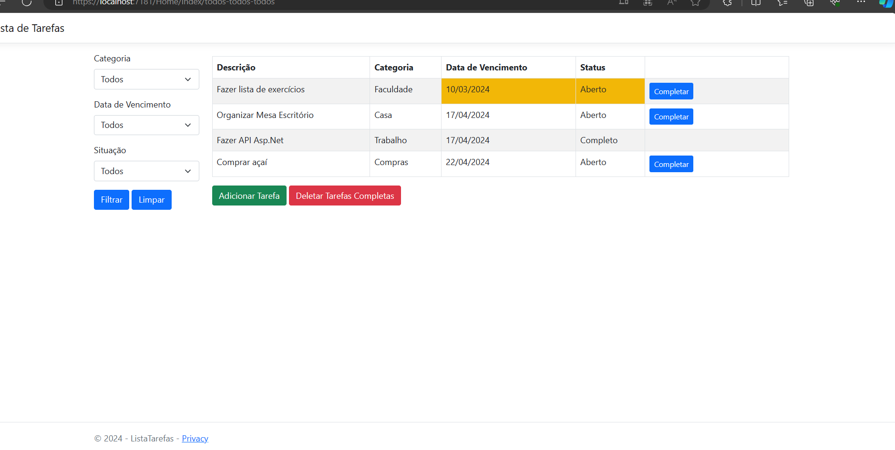
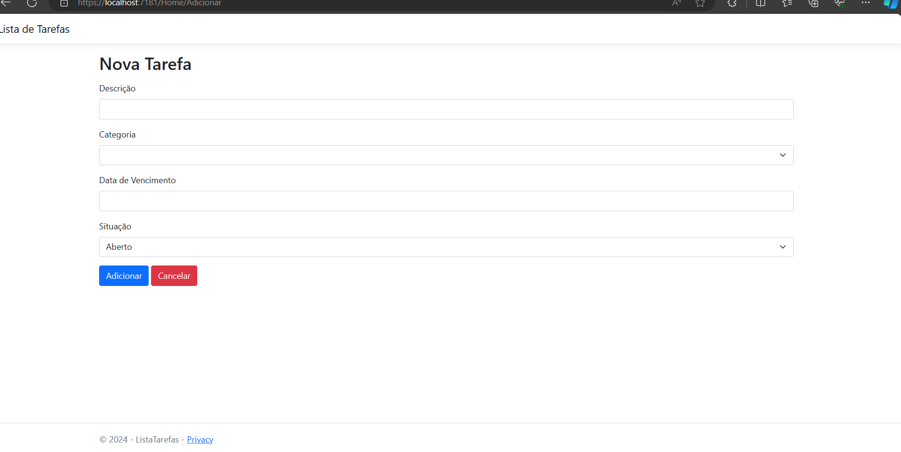

# Lista de Tarefas MVC ASP.NET

Este é um projeto simples de lista de tarefas criado em ASP.NET Core MVC, onde você pode adicionar, filtrar, marcar como completo e deletar tarefas.

## Funcionalidades

- **Index**: Exibe a lista de tarefas com opções de filtragem por categoria, status e data de vencimento.
- **Adicionar**: Permite adicionar uma nova tarefa à lista.
- **Filtrar**: Filtra as tarefas com base nas opções selecionadas pelo usuário.
- **Marcar Completo**: Marca uma tarefa como completa.
- **Deletar Completos**: Deleta todas as tarefas marcadas como completas.
- Tarefas atrasadas (com a data vencida) aparecem destacadas em amarelo.

## Requisitos

- .NET Core SDK
- IDE (Visual Studio, Visual Studio Code, etc.)

## Exemplo de Utilização

Aqui estão algumas capturas de tela da aplicação em execução:

